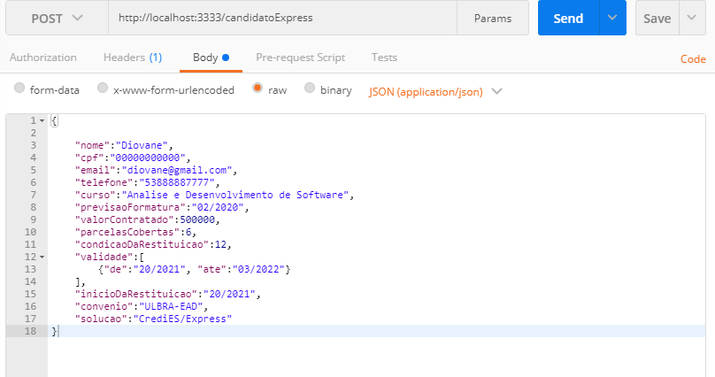
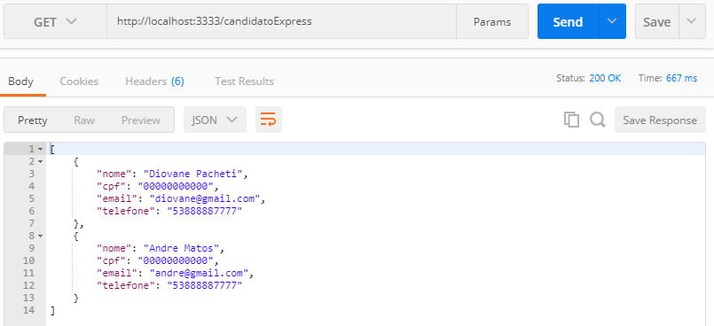
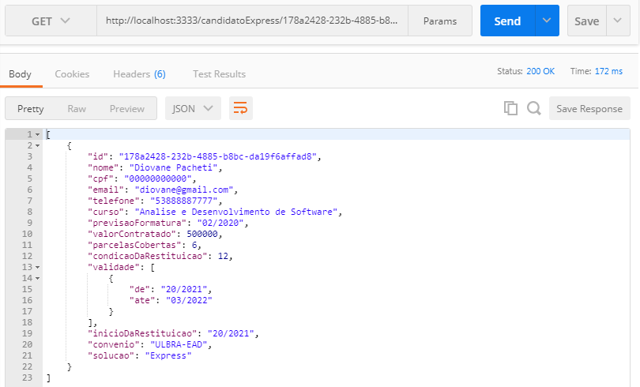
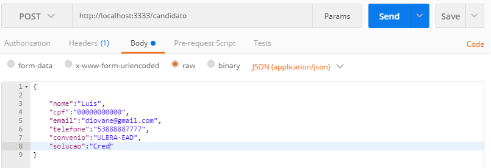
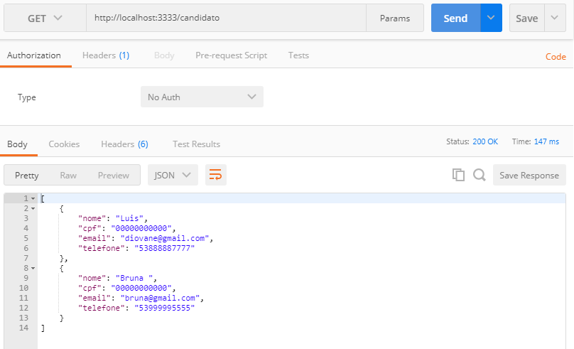
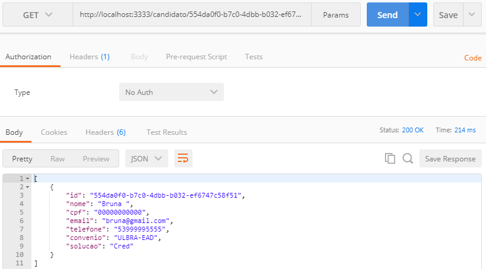
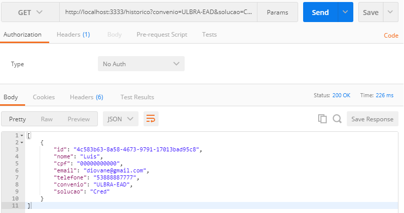

## Executar este projeto:

1. install `npm i` 
2. rodar `npm run dev` 

### Tecnologias utilizadas

- express
- sqlite3
- uuidv4
- ts-node-dev
- class-validator
- cors

## Routes

>Rota para criar um candidato express

>Rota lista todos os candidatos express 

>Rota retorna detalhes candidato Express

>Rota para criar um candidato

>Rota lista todos os candidatos cred

>Rota retorna detalhes candidato cred

>Rota Historico de Indicções Especial
>http://localhost:3333/historico?convenio=ULBRA-EAD&solucao=Cred&cpf=00000000000&nome=Luis

